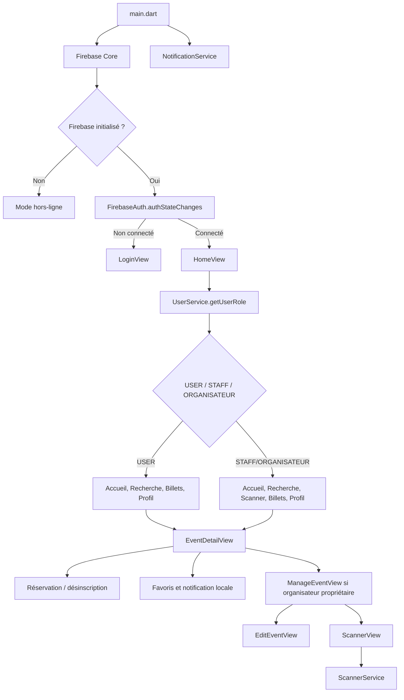
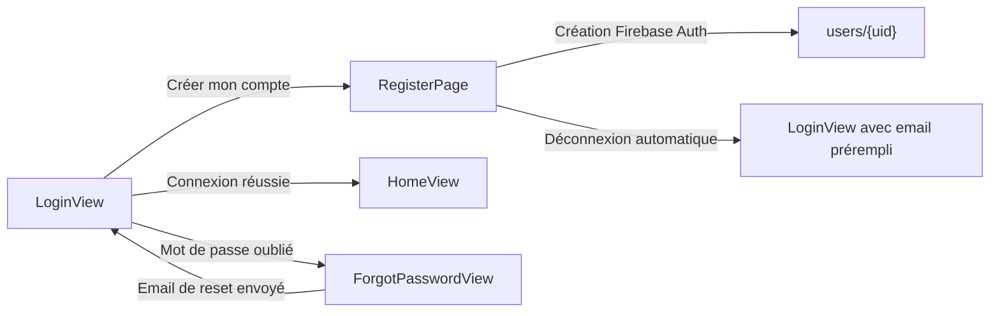
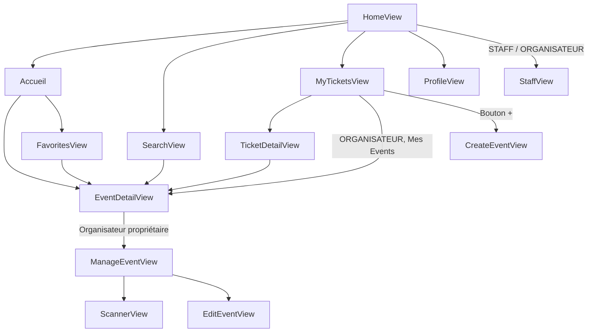
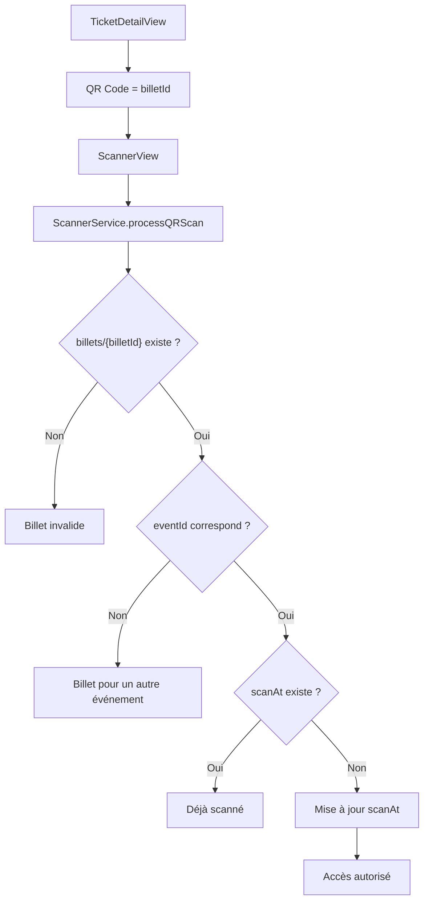

# Documentation technique - Buckshot

## 1. Architecture globale & stack technique

### Présentation générale

Buckshot est une application Flutter dédiée à la gestion d'événements, de réservations de places sous forme de "shotguns", de billets QR Code et de contrôle d'accès par scan. L'application s'appuie sur Firebase pour l'authentification, le stockage des données métier et la configuration multi-plateforme.

L'application Android est distribuée sous forme d'APK via Firebase App Distribution. Le projet Firebase associé est `buckshot-a9242`, avec l'application Android `com.shotgun.buckshot`.

### Stack technique

| Domaine | Technologie | Usage dans Buckshot |
|---|---|---|
| Application mobile | Flutter, Dart | Interface utilisateur, navigation, formulaires, écrans de gestion et widgets réutilisables. |
| Design system | Material 3, `BuckshotTheme`, Google Fonts Jura | Thème sombre global, palette Buckshot, typographie homogène. |
| Authentification | Firebase Authentication | Connexion, inscription, réinitialisation de mot de passe, déconnexion, réauthentification avant actions sensibles. |
| Base de données | Cloud Firestore | Utilisateurs, événements, billets, favoris/rappels, organisations et demandes d'accès. |
| Notifications locales | `flutter_local_notifications`, `timezone` | Planification d'alertes locales à l'ouverture d'une billetterie et navigation vers l'événement au clic. |
| QR Code | `qr_flutter`, `mobile_scanner` | Génération du QR Code d'un billet et scan côté staff/organisateur. |
| Images | `image_picker`, `image` | Sélection depuis galerie/caméra, redimensionnement, conversion Base64 pour les affiches d'événements. |
| Dates | `intl` | Formatage français des dates et heures (`fr_FR`). |
| Documents légaux | `flutter_markdown_plus`, assets Markdown | Affichage des mentions légales et de la politique de confidentialité. |
| Build Android | Gradle Kotlin DSL, Android namespace `com.shotgun.buckshot` | Génération APK et intégration Google Services. |
| Distribution | Firebase App Distribution | Déploiement de l'APK aux testeurs ou parties prenantes. |

### Configuration Firebase

La configuration Firebase est générée dans `lib/firebase_options.dart` et référence le projet `buckshot-a9242`.

| Plateforme | État dans le projet | Identifiant visible |
|---|---|---|
| Android | Configurée | `1:443286525719:android:2e47a17d1ecaf41d3c4952` |
| iOS | Configurée | `1:443286525719:ios:536d9060940619a43c4952` |
| macOS | Configurée | Même configuration que iOS |
| Web | Configurée | `1:443286525719:web:c891e0d384fba88a3c4952` |
| Windows | Configurée | `1:443286525719:web:52cf5cadeafe35943c4952` |
| Linux | Non configurée dans FlutterFire | L'application affiche un mode hors-ligne si Firebase ne s'initialise pas. |

### Initialisation applicative

Le point d'entrée `lib/main.dart` suit le cycle suivant :

1. Initialisation Flutter avec `WidgetsFlutterBinding.ensureInitialized()`.
2. Initialisation des formats de date français via `initializeDateFormatting('fr_FR', null)`.
3. Initialisation Firebase avec `Firebase.initializeApp`.
4. Initialisation des notifications locales via `NotificationService().initNotification`.
5. Demande de permission Android pour les alarmes exactes via `checkExactAlarmPermission`.
6. Lancement de `MyApp`.

`MyApp` expose une `GlobalKey<NavigatorState>` utilisée par les notifications locales. Lorsqu'une notification contient un `payload` correspondant à un `eventId`, l'application navigue vers `EventDetailView(eventId: eventId)`.

### Architecture fonctionnelle

L'architecture est organisée en quatre couches applicatives principales :

| Couche | Dossier | Responsabilité |
|---|---|---|
| Modèles | `lib/models/` | Conversion des documents Firestore en objets Dart et représentation des enums métier. |
| Services | `lib/services/` | Authentification, lecture de rôles, événements, scanner, notifications et seed de données. |
| Vues | `lib/views/` | Écrans complets : accueil, login, profil, recherche, billets, gestion d'événement, scanner. |
| Widgets | `lib/widgets/` | Composants UI réutilisables : champs, barre de navigation, recherche, sections profil, listes. |



### Structure des écrans principaux

| Écran | Rôle fonctionnel |
|---|---|
| `LoginView` | Connexion email/mot de passe, accès à l'inscription, reset password et documents légaux. |
| `RegisterPage` | Création de compte Firebase Auth et profil Firestore associé. |
| `HomeView` | Shell principal avec navigation basse dynamique selon le rôle. |
| `SearchView` | Recherche et classement des événements en trois onglets : à venir, en cours, passés. |
| `EventDetailView` | Détail événement, inscription, désinscription, favoris, rappel et accès au dashboard organisateur. |
| `FavoritesView` | Liste des événements placés en favori. |
| `MyTicketsView` | Billets utilisateur et, pour les organisateurs, liste des événements gérés. |
| `TicketDetailView` | Affichage du billet et du QR Code. |
| `StaffView` | Liste des événements scannables pour une organisation. |
| `ScannerView` | Scan QR Code et retour d'état d'accès. |
| `ManageEventView` | Tableau de bord d'un événement : statistiques, scanner, modification, annulation. |
| `CreateEventView` | Création d'un événement par un organisateur rattaché à une organisation. |
| `EditEventView` | Modification des informations d'un événement existant. |
| `ProfileView` | Profil utilisateur, sécurité, organisation, demandes d'accès et gestion des membres. |

## 2. Modèle de données & base de données

### Collections applicatives

| Collection | Description | Usage applicatif |
|---|---|---|
| `users` | Profils utilisateurs liés aux comptes Firebase Auth. | Rôles, identité, email, rattachement organisation. |
| `events` | Catalogue des événements. | Accueil, recherche, détail, création, édition, dashboard organisateur. |
| `organizers` | Organisations créatrices d'événements. | Affichage du nom d'organisation et rattachement des membres. |
| `billets` | Billets réservés dans le flux applicatif actuel. | QR Code, liste des billets, scan, statistiques de vente. |
| `reminders` | Favoris et rappels d'ouverture de billetterie. | Favoris, icône d'intérêt, notification locale. |
| `demandes_organisation` | Demandes d'accès à une organisation depuis le profil. | Suivi de demande, validation/refus par un organisateur. |
| `tickets` | Collection présente dans le service historique `DatabaseService` et dans les règles fournies. | Validation par token dans le service historique. |
| `demandes_orga` | Collection couverte par les règles Firestore fournies. | Demandes organisation selon la politique Firestore communiquée. |

### Modèle `EventModel`

Fichier : `lib/models/event_model.dart`

| Champ | Type Dart | Type Firestore | Rôle |
|---|---|---|---|
| `id` | `String` | ID document | Identifiant de l'événement. |
| `nom` | `String` | `String` | Titre affiché dans les listes, détails et billets. |
| `description` | `String` | `String` | Description complète. |
| `lieu` | `String` | `String` | Localisation de l'événement. |
| `idOrganisateur` | `String` | `String` | Référence logique vers `organizers/{orgaId}`. |
| `capaciteMax` | `int` | `number` | Capacité totale. |
| `placesRestantes` | `int` | `number` | Places encore disponibles. |
| `dateHeureEvent` | `DateTime` | `Timestamp` | Date et heure de début. |
| `dateFinEvent` | `DateTime` | `Timestamp` | Date et heure de fin. |
| `dateOuvertureBilletterie` | `DateTime` | `Timestamp` | Ouverture du shotgun. |
| `dateFermetureBilletterie` | `DateTime` | `Timestamp` | Fermeture du shotgun. |
| `image` | `String` | `String` Base64 | Affiche de l'événement. |

### Modèle utilisateur

Le profil utilisateur est stocké dans `users/{uid}`.

| Champ | Type Firestore | Rôle |
|---|---|---|
| `uid` | `String` | Identifiant Firebase Auth de l'utilisateur. |
| `prenom` | `String` | Prénom affiché dans le profil, le scan et la gestion des membres. |
| `nom` | `String` | Nom affiché avec le prénom. |
| `email` | `String` | Adresse email du compte. |
| `role` | `String` | Rôle applicatif : `USER`, `STAFF`, `ORGANISATEUR`, `ADMIN` côté règles. |
| `createdAt` | `Timestamp` | Date de création du profil. |
| `idOrganisateur` | `String` | Organisation rattachée pour les profils staff/organisateur. |

### Modèle `GroupeOrganisateur`

Fichier : `lib/models/groupe_organisateur_model.dart`

| Champ | Type Dart | Type Firestore | Rôle |
|---|---|---|---|
| `idOrganisation` | `String` | ID document | Identifiant de l'organisation. |
| `nom` | `String` | `String` | Nom affiché dans les événements et le profil. |
| `urlLogo` | `String` | `String` | URL ou chemin du logo de l'organisation. |

### Modèle `DemandeOrgaModel`

Fichier : `lib/models/demande_orga_model.dart`

| Champ | Type Dart | Type Firestore | Rôle |
|---|---|---|---|
| `userId` | `String` | ID document / `String` | Utilisateur demandeur. |
| `userNom` | `String` | `String` | Nom complet du demandeur. |
| `orgaId` | `String` | `String` | Organisation ciblée. |
| `orgaNom` | `String` | `String` | Nom de l'organisation. |
| `roleDemande` | `String` | `String` | Rôle demandé : `STAFF` ou `ORGANISATEUR`. |
| `status` | `String` | `String` | État de la demande : `EN_ATTENTE` ou `REFUSE`. |

### Modèle billet applicatif `billets`

Les billets utilisés par les écrans principaux sont créés dans `EventDetailView` lors de l'inscription.

| Champ | Type Firestore | Rôle |
|---|---|---|
| `userId` | `String` | Utilisateur propriétaire du billet. |
| `eventId` | `String` | Événement associé. |
| `createdAt` | `Timestamp` | Date de réservation. |
| `scanAt` | `Timestamp` ou `null` | Date de scan si le billet a déjà été validé. |
| `scannedBy` | `String` | Champ ajouté lors du scan. |

L'identifiant du document `billets/{billetId}` est encodé dans le QR Code présenté dans `TicketDetailView`.

### Modèle ticket historique `tickets`

La collection `tickets` est manipulée par `DatabaseService.validerBillet` et couverte par les règles Firestore fournies.

| Champ | Type Firestore | Rôle |
|---|---|---|
| `idUtilisateur` | `String` | Utilisateur propriétaire. |
| `idEvenement` | `String` | Événement associé. |
| `statut` | `String` | État du ticket : `VALIDE` ou `SCANNE`. |
| `timestampInscription` | `Timestamp` | Date d'inscription. |
| `idToken` | `String` | Token utilisé par le validateur historique. |

### Modèle `reminders`

| Champ | Type Firestore | Rôle |
|---|---|---|
| `userId` | `String` | Propriétaire du rappel. |
| `eventId` | `String` | Événement suivi. |
| `createdAt` | `Timestamp` | Date d'ajout. |
| `notified` | `bool` | État logique du rappel. |

Le document est créé avec l'identifiant `${uid}_${eventId}`.

### Enums métier

| Enum | Valeurs | Usage |
|---|---|---|
| `StatutBillet` | `VALIDE`, `SCANNE`, `ANNULE` | Représentation typée d'un statut billet. |
| `Role` | `etudiant`, `staff`, `organisateur`, `admin`, `unknown` | Représentation Dart des rôles. Les vues utilisent les valeurs Firestore en majuscules. |

## 3. Gestion des états & flux de navigation

### Gestion des états

L'application utilise principalement des `StatefulWidget`, des contrôleurs Flutter et des `StreamBuilder` Firestore.

| Zone | Gestion d'état |
|---|---|
| Authentification globale | `StreamBuilder<User?>` sur `FirebaseAuth.instance.authStateChanges()`. |
| Navigation principale | `HomeView` maintient `_currentIndex` et reconstruit les onglets selon le rôle. |
| Formulaires | `TextEditingController`, validations locales, indicateurs `_isLoading`. |
| Données temps réel | `StreamBuilder` sur `users`, `events`, `billets`, `reminders`, `organizers`, `demandes_organisation`. |
| Scanner | `ScannerService extends ChangeNotifier`, écouté par `ScannerView`. |
| Onglets | `TabController` dans `SearchView` et `MyTicketsView`. |
| Notifications | Callback de notification vers le `NavigatorState` global. |

### Flux d'authentification



Lors de l'inscription, l'application crée un compte Firebase Auth, puis crée le document `users/{uid}` avec le rôle `USER`. Après inscription, l'utilisateur est déconnecté et renvoyé vers l'écran de connexion avec son email prérempli.

### Flux de navigation principal



### Rôles applicatifs

| Rôle | Accès fonctionnels observés |
|---|---|
| `USER` | Consultation du catalogue, recherche, inscription, désinscription, favoris, billets, profil. |
| `STAFF` | Accès à la vue scanner via la navigation principale, selon rattachement organisation. |
| `ORGANISATEUR` | Gestion des événements de son organisation, création, modification, annulation, scan, gestion des demandes et membres. |
| `ADMIN` | Rôle prévu dans les règles Firestore pour l'administration des événements, organisations et demandes. |

### Flux réservation

Dans `EventDetailView`, la réservation s'effectue via une transaction Firestore :

1. Lecture de `events/{eventId}`.
2. Vérification de l'existence de l'événement.
3. Vérification de l'ouverture de la billetterie.
4. Vérification de l'absence de billet existant pour le couple utilisateur/événement.
5. Vérification des places restantes.
6. Décrémentation de `placesRestantes`.
7. Création d'un document dans `billets`.

La désinscription utilise aussi une transaction :

1. Recherche du billet utilisateur pour l'événement.
2. Suppression du document billet.
3. Incrémentation de `placesRestantes`.

### Flux favoris et notifications

Lorsqu'un utilisateur ajoute un événement en favori :

1. Un document `reminders/{uid_eventId}` est créé.
2. Si la date d'ouverture de billetterie est future, une notification locale est planifiée.
3. Le `payload` de notification contient l'identifiant de l'événement.
4. Au clic sur la notification, `main.dart` navigue vers `EventDetailView(eventId: eventId)`.

### Flux scan QR Code



`ScannerService` affiche automatiquement le résultat du scan et réinitialise l'état après cinq secondes.

### Gestion événement organisateur

`ManageEventView` centralise les actions de pilotage d'un événement :

| Fonction | Description |
|---|---|
| Statistiques de vente | Calcule les billets réservés, le taux de remplissage et les entrées scannées. |
| Scanner les billets | Ouvre `ScannerView` avec l'événement courant. |
| Modifier les informations | Ouvre `EditEventView`. |
| Annuler définitivement | Supprime l'événement et les billets associés. |

`EditEventView` permet de modifier le titre, la description, les dates, le lieu, le nombre de places et l'affiche. La capacité mise à jour recalcule les places restantes en conservant le nombre de places déjà vendues.

### Documents légaux et textes riches

Les mentions légales et la politique de confidentialité sont stockées dans :

| Asset | Usage |
|---|---|
| `assets/markdown/mentions_legales.md` | Affichage depuis login, inscription et profil. |
| `assets/markdown/privacy_politique.md` | Affichage depuis login, inscription et profil. |

Les liens textuels sont rendus avec `Text.rich`, `TextSpan` et `TapGestureRecognizer`. Le contenu Markdown est chargé via `rootBundle.loadString` puis affiché dans une `AlertDialog` avec `MarkdownBody`.

## 4. Authentification & sécurité Firebase

### Authentification

Le service `AuthService` encapsule les opérations Firebase Auth suivantes :

| Méthode | API Firebase | Fonction |
|---|---|---|
| `signInWithEmailAndPassword` | `FirebaseAuth.signInWithEmailAndPassword` | Connexion utilisateur. |
| `createUserWithEmailAndPassword` | `FirebaseAuth.createUserWithEmailAndPassword` | Création d'un compte. |
| `resetPassword` | `FirebaseAuth.sendPasswordResetEmail` | Envoi d'un email de réinitialisation. |

### Réauthentification

Les opérations sensibles utilisent `EmailAuthProvider.credential` puis `reauthenticateWithCredential` :

| Action | Écran | Séquence |
|---|---|---|
| Modification du mot de passe | `ProfileView`, `PasswordSection` | Ancien mot de passe, réauthentification, `updatePassword`. |
| Suppression de compte | `ProfileView` | Saisie du mot de passe, réauthentification, suppression Firestore puis `user.delete()`. |

### Règles Firestore communiquées

Les règles Firestore fournies pour l'environnement Buckshot sont les suivantes :

```javascript
rules_version = '2';
service cloud.firestore {
  match /databases/{database}/documents {

    // ---------- Fonctions utilitaires ----------
    function isSignedIn() {
      return request.auth != null;
    }

    function userData() {
      return get(/databases/$(database)/documents/users/$(request.auth.uid)).data;
    }

    function hasRole(role) {
      return isSignedIn() && userData().role == role;
    }

    function isStaffOrAbove() {
      return hasRole('STAFF') || hasRole('ORGANISATEUR') || hasRole('ADMIN');
    }

    // ---------- USERS ----------
    match /users/{userId} {
      // Lecture : soi-même, ou staff/orga (besoin de voir les noms au scan)
      allow read: if isSignedIn() && (request.auth.uid == userId || isStaffOrAbove());

      // Création : seulement son propre doc, et SANS pouvoir se définir un rôle privilégié
      allow create: if isSignedIn()
                    && request.auth.uid == userId
                    && request.resource.data.role == 'USER';

      // MAJ de son profil, mais interdiction de changer son propre rôle
      allow update: if isSignedIn()
                    && request.auth.uid == userId
                    && request.resource.data.role == resource.data.role;

      allow delete: if false;
    }

    // ---------- EVENTS ----------
    match /events/{eventId} {
      allow read: if true; // catalogue public, OK
      allow create, update, delete: if hasRole('ORGANISATEUR') || hasRole('ADMIN');
    }

    // ---------- ORGANIZERS ----------
    match /organizers/{orgaId} {
      allow read: if true;
      allow write: if hasRole('ADMIN');
    }

    // ---------- TICKETS / BILLETS ----------
    match /tickets/{ticketId} {
      // L'utilisateur lit ses propres billets ; le staff lit tout (scan)
      allow read: if isSignedIn()
                  && (resource.data.idUtilisateur == request.auth.uid || isStaffOrAbove());

      // Création d'une inscription : pour soi, statut imposé à VALIDE
      allow create: if isSignedIn()
                    && request.resource.data.idUtilisateur == request.auth.uid
                    && request.resource.data.statut == 'VALIDE';

      // Mise à jour réservée au staff (passage en SCANNE)
      allow update: if isStaffOrAbove();

      allow delete: if false;
    }

    // ---------- DEMANDES ORGA ----------
    match /demandes_orga/{demandeId} {
      allow read: if isStaffOrAbove() || resource.data.userId == request.auth.uid;
      allow create: if isSignedIn()
                    && request.resource.data.userId == request.auth.uid
                    && request.resource.data.status == 'EN_ATTENTE';
      allow update, delete: if hasRole('ADMIN');
    }

    // ---------- Tout le reste : fermé ----------
    match /{document=**} {
      allow read, write: if false;
    }
  }
}
```

### Portée fonctionnelle des règles

| Collection | Lecture | Écriture |
|---|---|---|
| `users` | Utilisateur lui-même, staff, organisateur, admin | Création par soi-même avec rôle `USER`; mise à jour de son profil sans changement de rôle. |
| `events` | Publique | `ORGANISATEUR` ou `ADMIN`. |
| `organizers` | Publique | `ADMIN`. |
| `tickets` | Propriétaire ou staff et au-dessus | Création par le propriétaire avec statut `VALIDE`; mise à jour par staff et au-dessus. |
| `demandes_orga` | Staff et au-dessus ou demandeur | Création par le demandeur avec statut `EN_ATTENTE`; update/delete par admin. |
| Autres chemins | Fermé | Fermé. |

### Permissions Android

Le manifeste Android déclare les permissions suivantes :

| Permission | Usage |
|---|---|
| `INTERNET` | Accès Firebase et services réseau. |
| `ACCESS_NETWORK_STATE` | État réseau. |
| `POST_NOTIFICATIONS` | Notifications Android récentes. |
| `SCHEDULE_EXACT_ALARM` | Planification exacte des rappels d'ouverture. |
| `RECEIVE_BOOT_COMPLETED` | Conservation des notifications planifiées après redémarrage. |
| `VIBRATE` | Vibration notification. |
| `WAKE_LOCK` | Gestion notification/alarme. |

## 5. Livraison, exploitation & structure projet

### Livraison APK via Firebase App Distribution

L'application Android est livrée sous forme d'APK et distribuée via Firebase App Distribution.

| Élément | Valeur |
|---|---|
| Projet Firebase | `buckshot-a9242` |
| Application Android | `com.shotgun.buckshot` |
| App ID Firebase Android | `1:443286525719:android:2e47a17d1ecaf41d3c4952` |
| Version Flutter | `1.0.0+1` dans `pubspec.yaml` |
| Configuration Google Services | `android/app/google-services.json` |
| Build Android | `android/app/build.gradle.kts` |

Le build Android utilise :

- `com.android.application`
- `com.google.gms.google-services`
- `kotlin-android`
- `dev.flutter.flutter-gradle-plugin`
- Java 17
- `coreLibraryDesugaring`

### Assets embarqués

| Asset | Usage |
|---|---|
| `assets/BuckshotLogoLong.png` | Logo principal sur login, register, accueil. |
| `assets/BuckshotLogoShort.png` | Logo court. |
| `assets/logo.png` | Icône launcher. |
| `assets/logoDessusDessous.png` | Logo splash screen. |
| `assets/fond.png` | Image de fond splash screen. |
| `assets/soiree.png` | Image de secours pour événements sans image valide. |
| `assets/markdown/privacy_politique.md` | Politique de confidentialité. |
| `assets/markdown/mentions_legales.md` | Mentions légales. |

### Splash screen et icône

La configuration `flutter_native_splash` utilise :

| Paramètre | Valeur |
|---|---|
| `background_image` | `assets/fond.png` |
| `image` | `assets/logoDessusDessous.png` |
| `fullscreen` | `true` |
| Android 12 image | `assets/logoDessusDessous.png` |
| Android 12 background | `#0B0914` |

La configuration `flutter_launcher_icons` utilise `assets/logo.png` pour Android et iOS.

### Structure projet

| Chemin | Contenu |
|---|---|
| `lib/main.dart` | Initialisation Firebase, notifications, routing initial. |
| `lib/firebase_options.dart` | Options Firebase générées par FlutterFire CLI. |
| `lib/buckshot_theme.dart` | Thème global Buckshot. |
| `lib/models/` | Modèles `EventModel`, `GroupeOrganisateur`, `DemandeOrgaModel`, billet et enums. |
| `lib/services/` | Services d'authentification, événements, user role, scanner, notifications. |
| `lib/views/` | Écrans applicatifs complets. |
| `lib/widgets/` | Widgets partagés. |
| `assets/` | Images, logos et documents Markdown. |
| `android/` | Projet Android et configuration APK. |
| `docs/` | Documentation technique. |

### Conventions de développement observées

| Élément | Convention |
|---|---|
| Fichiers Dart | `snake_case.dart` |
| Vues | Suffixe `View`, avec exception `RegisterPage`. |
| Services | Suffixe `Service`. |
| Modèles | Suffixe `Model` pour les principaux modèles. |
| Navigation | `Navigator.push`, `pushReplacement`, `pushAndRemoveUntil`, `PageRouteBuilder`. |
| Temps réel Firestore | `StreamBuilder`. |
| Chargement ponctuel | `FutureBuilder`. |
| Formulaires | `TextEditingController`, validation locale et SnackBars. |
| Images événements | Base64 stocké dans le champ `image`. |
| Dates | `Timestamp` Firestore converti en `DateTime` et formaté via `intl`. |

### Modules applicatifs

| Module | Fichiers principaux |
|---|---|
| Authentification | `auth_service.dart`, `login_view.dart`, `register_view.dart`, `forgot_password_view.dart` |
| Accueil catalogue | `home_view.dart`, `event_service.dart`, `shotgun_banner.dart`, `shotgun_item.dart` |
| Recherche | `search_view.dart`, `barre_de_recherche.dart` |
| Billets | `my_tickets_view.dart`, `ticket_detail_view.dart` |
| Scanner | `staff_view.dart`, `scanner_view.dart`, `scanner_service.dart` |
| Gestion événement | `create_event_view.dart`, `manage_event_view.dart`, `edit_event_view.dart` |
| Profil et organisation | `profile_view.dart`, `received_requests_list.dart`, `organisation_section.dart`, `profile_info_section.dart` |
| Notifications | `notification_service.dart`, intégration dans `main.dart` et `EventDetailView` |
| Documents légaux | `privacy_checkbox.dart`, `login_view.dart`, `profile_view.dart`, assets Markdown |
