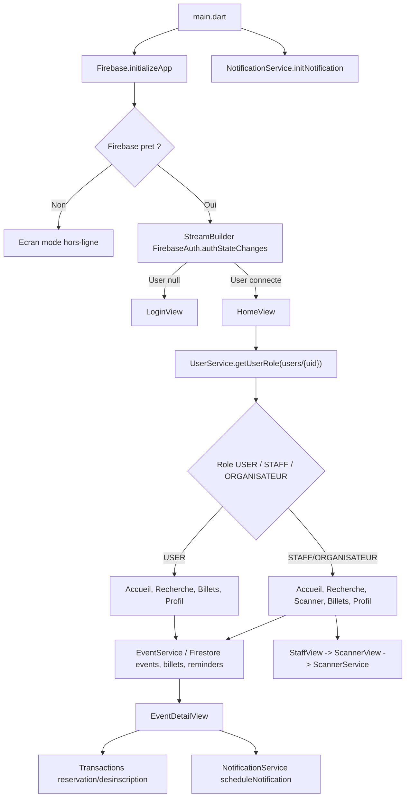
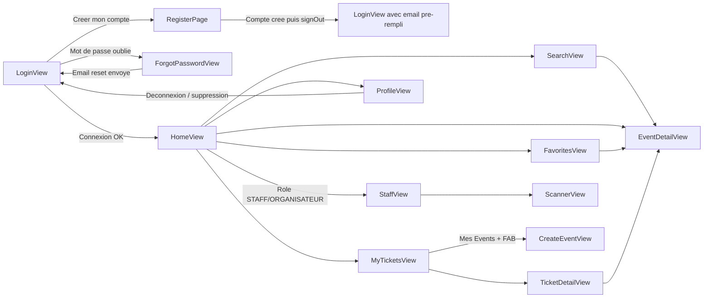

# Documentation technique Buckshot

## 1. Architecture Globale & Stack Technique

### Stack technique observee

Buckshot est une application Flutter multi-plateforme construite autour de Firebase. Le point d'entree applicatif est `lib/main.dart`, qui initialise Flutter, la localisation de dates `fr_FR`, les notifications locales, puis Firebase via `DefaultFirebaseOptions.currentPlatform`.

| Domaine | Technologies / packages | Usage constate dans le code |
|---|---|---|
| Framework UI | Flutter, Material 3 | Interfaces mobiles composees en `StatefulWidget` et `StatelessWidget`, theme sombre global via `BuckshotTheme.darkTheme`. |
| Authentification | `firebase_auth` | Connexion, inscription, deconnexion, reset password, reauthentification avant changement de mot de passe et suppression de compte. |
| Base de donnees | `cloud_firestore` | Stockage des utilisateurs, evenements, billets, favoris/rappels, organisations et demandes d'acces. |
| Notifications locales | `flutter_local_notifications`, `timezone` | Planification d'une notification locale a l'ouverture de billetterie lorsqu'un utilisateur met un evenement en favori. |
| QR code | `qr_flutter`, `mobile_scanner` | Generation du QR code billet depuis l'identifiant du document `billets`; scan mobile cote staff. |
| Media | `image_picker`, `image` | Selection, redimensionnement et encodage Base64 des images d'evenements avant stockage dans Firestore. |
| Internationalisation date | `intl` | Formatage francais des dates dans les vues evenements, tickets, recherche, staff et scanner. |
| Documents Markdown | `flutter_markdown_plus` | Affichage de la politique de confidentialite depuis les assets Markdown. |
| Typographie | `google_fonts` | Theme global Jura et usages directs dans plusieurs vues. |

Les plateformes configurees Firebase sont Web, Android, iOS, macOS et Windows. Linux n'est pas configure dans `firebase_options.dart`; `main.dart` capture l'erreur d'initialisation Firebase et affiche un ecran "Mode hors-ligne (Firebase desactive)".

### Structure des dossiers

| Dossier | Role |
|---|---|
| `lib/models/` | Modeles de conversion Firestore/Dart et enums metier. |
| `lib/services/` | Services d'acces Firebase, notifications, scanner et seed. |
| `lib/views/` | Ecrans principaux de l'application. Une part importante de la logique metier Firebase y reside encore. |
| `lib/widgets/` | Composants UI reutilisables: champs, navigation, sections profil, liste de demandes, date picker. |
| `assets/` | Logos, image fallback de soiree et fichiers Markdown juridiques. |
| `android/`, `ios/`, `web/`, `windows/`, `macos/`, `linux/` | Cibles Flutter generees ou configurees. |

### Architecture applicative constatee

L'application ne suit pas une Clean Architecture stricte. Le pattern dominant est:

- UI Flutter avec `StatefulWidget` pour les ecrans contenant formulaires, onglets, chargements ou etats locaux.
- Services legers (`AuthService`, `UserService`, `EventService`, `ScannerService`, `DatabaseService`) pour certains acces transverses.
- Acces Firestore directs dans de nombreuses vues, notamment `EventDetailView`, `ProfileView`, `MyTicketsView`, `StaffView`, `FavoritesView`, `SearchView` et `CreateEventView`.
- Etat temps reel gere via `StreamBuilder` sur les collections/documents Firestore.
- Navigation imperative via `Navigator.push`, `pushReplacement` et `pushAndRemoveUntil`.

Cette architecture correspond davantage a un modele "Flutter MVC/MVVM pragmatique": les vues portent le controleur local et appellent Firestore directement, tandis que certains services centralisent des flux simples.



### Initialisation applicative

`main.dart` execute les etapes suivantes:

1. `WidgetsFlutterBinding.ensureInitialized()`.
2. `initializeDateFormatting('fr_FR', null)` pour permettre les formats de date francais.
3. `NotificationService().initNotification()` puis `checkExactAlarmPermission()` pour Android.
4. `Firebase.initializeApp(options: DefaultFirebaseOptions.currentPlatform)`.
5. `runApp(MyApp(isFirebaseReady: firebaseInitialized))`.

`MyApp` utilise `StreamBuilder<User?>` sur `FirebaseAuth.instance.authStateChanges()`:

- etat `waiting`: spinner.
- utilisateur connecte: `HomeView`.
- aucun utilisateur: `LoginView`.

## 2. Modele de Donnees & Base de donnees

### Vue globale Firestore

Les collections suivantes sont observees dans le code:

| Collection | Usage principal | Documents |
|---|---|---|
| `users` | Profils applicatifs associes aux comptes Firebase Auth. | Document id = `uid` Firebase Auth. |
| `events` | Evenements et billetterie. | Document id auto-genere par `.add()` dans la creation actuelle. |
| `billets` | Billets reserves par les utilisateurs, QR scannables. | Document id auto-genere; cet id est encode dans le QR code. |
| `reminders` | Favoris/rappels d'ouverture de billetterie. | Document id = `${uid}_${eventId}` dans `EventDetailView`. |
| `organizers` | Groupes organisateurs. | Document id = identifiant organisation. |
| `demandes_organisation` | Demandes utilisateur pour rejoindre une organisation. | Document id = `uid` du demandeur. |
| `tickets` | Ancien/flux alternatif de tickets utilise par `DatabaseService.validerBillet` et `seed_database.dart`. | Document id quelconque, recherche par `idToken`. |

Important: le flux metier principal actuel utilise `billets`, pas `tickets`. `tickets` apparait comme heritage ou prototype: son schema (`idUtilisateur`, `idEvenement`, `statut`, `idToken`) ne correspond pas au scanner actif, qui lit `billets/{billetId}` avec `userId`, `eventId` et `scanAt`.

### Modele `EventModel` (`lib/models/event_model.dart`)

| Champ Dart | Type Dart | Champ Firestore | Role |
|---|---|---|---|
| `id` | `String` | id document | Identifiant logique de l'evenement. Dans `CreateEventView`, une cle `event_${titre}_${date}` est construite mais n'est pas utilisee comme id Firestore car l'insertion fait `.add()`. |
| `nom` | `String` | `nom` | Titre affiche dans accueil, recherche, tickets, staff, detail. |
| `description` | `String` | `description` | Texte detaille de l'evenement. |
| `lieu` | `String` | `lieu` | Lieu affiche dans listes et detail. |
| `idOrganisateur` | `String` | `idOrganisateur` | Reference vers `organizers/{id}` et filtre des evenements accessibles au staff. |
| `capaciteMax` | `int` | `capaciteMax` | Capacite initiale. |
| `placesRestantes` | `int` | `placesRestantes` | Compteur transactionnel decremente/incremente lors des inscriptions/desinscriptions. |
| `dateHeureEvent` | `DateTime` | `dateHeureEvent` | Date de debut, base du tri et des onglets a venir/en cours/passes. |
| `dateFinEvent` | `DateTime` | `dateFinEvent` | Date de fin, utilisee pour les onglets et la disponibilite scanner. |
| `dateOuvertureBilletterie` | `DateTime` | `dateOuvertureBilletterie` | Date d'ouverture du shotgun; bloque l'inscription avant ouverture. |
| `dateFermetureBilletterie` | `DateTime` | `dateFermetureBilletterie` | Date de fermeture de billetterie dans le modele et la creation. |
| `image` | `String` | `image` | Image d'evenement encodee en Base64. Fallback asset si vide ou invalide. |

Point d'attention: `EventModel.fromFirestore` mappe actuellement `dateFermetureBilletterie` depuis `dateFinEvent` au lieu de `dateFermetureBilletterie`. Les vues lisent souvent les champs bruts Firestore, ce qui masque partiellement l'erreur, mais toute utilisation du modele peut propager une date de fermeture incorrecte.

### Modele utilisateur (`lib/models/utilisateur_model.dart`)

Le fichier `utilisateur_model.dart` contient une classe nommee `EventModel`, ce qui est incoherent avec son contenu. Fonctionnellement, ce modele represente un utilisateur.

| Champ Dart | Type Dart | Champ Firestore | Role |
|---|---|---|---|
| `idUtilisateur` | `String` | id document | Identifiant utilisateur, normalement `uid` Firebase Auth. |
| `nom` | `String` | `nom` | Nom de famille. |
| `prenom` | `String` | `prenom` | Prenom. |
| `email` | `String` | `email` | Email du compte. |
| `role` | `Role` | `role` | Role applicatif. Attention: l'enum Dart contient `etudiant/staff/organisateur/admin`, tandis que Firestore utilise `USER/STAFF/ORGANISATEUR`. |
| `createdAt` | `DateTime` | `createdAt` | Date de creation du profil. |

Schema reel `users/{uid}` observe:

| Champ | Type Firestore attendu | Role |
|---|---|---|
| `uid` | `String` | Stocke explicitement l'uid lors de l'inscription. |
| `prenom` | `String` | Prenom editable dans le profil. |
| `nom` | `String` | Nom editable dans le profil. |
| `email` | `String` | Email affiche, non editable dans `ProfileView`. |
| `role` | `String` | `USER`, `STAFF` ou `ORGANISATEUR` dans les vues. |
| `createdAt` | `Timestamp` | Timestamp serveur a l'inscription. |
| `idOrganisateur` | `String` | Organisation rattachee pour `STAFF` et `ORGANISATEUR`; peut etre absent ou vide pour `USER`. |

### Enum `Role` (`lib/models/role_model.dart`)

| Valeur | Usage observe |
|---|---|
| `etudiant` | Valeur par defaut du modele utilisateur Dart, mais non alignee avec Firestore. |
| `staff` | Valeur enum Dart non directement utilisee par les vues. |
| `organisateur` | Valeur enum Dart non directement utilisee par les vues. |
| `admin` | Declaree mais non observee dans les flux UI. |
| `unknown` | Declaree mais non exploitee. |

Les vues testent des chaines majuscules: `USER`, `STAFF`, `ORGANISATEUR`.

### Modele `GroupeOrganisateur` (`lib/models/groupe_organisateur_model.dart`)

| Champ Dart | Type Dart | Champ Firestore | Role |
|---|---|---|---|
| `idOrganisation` | `String` | id document | Identifiant de l'organisation. |
| `nom` | `String` | `nom` | Nom affiche dans les details d'evenement, profils et demandes. |
| `urlLogo` | `String` | `urlLogo` | URL/logo declare; peu exploite dans les vues actuelles. |

Collection: `organizers/{orgaId}`.

### Modele `DemandeOrgaModel` (`lib/models/demande_orga_model.dart`)

| Champ Dart | Type Dart | Champ Firestore | Role |
|---|---|---|---|
| `userId` | `String` | id document ou `userId` | Le factory prend `doc.id`; les documents sont crees avec l'id utilisateur. |
| `userNom` | `String` | `userNom` | Nom complet affiche aux organisateurs. |
| `orgaId` | `String` | `orgaId` | Organisation cible. |
| `orgaNom` | `String` | `orgaNom` | Nom de l'organisation au moment de la demande. |
| `roleDemande` | `String` | `roleDemande` | Role demande: `STAFF` ou `ORGANISATEUR`. |
| `status` | `String` | `status` | `EN_ATTENTE` ou `REFUSE`; l'acceptation supprime le document. |

Champ supplementaire cree mais non present dans le modele: `createdAt` (`FieldValue.serverTimestamp()`).

### Modele `BilletInscriptionModel` (`lib/models/billet_inscription_model.dart`)

Ce modele correspond au vocabulaire `idUtilisateur/idEvenement/statutBillet`, mais le flux actif `billets` utilise plutot `userId/eventId/scanAt`.

| Champ Dart | Type Dart | Champ Firestore | Role |
|---|---|---|---|
| `idUtilisateur` | `String` | `idUtilisateur` | Identifiant utilisateur, ancien schema. |
| `idEvenement` | `String` | `idEvenement` | Identifiant evenement, ancien schema. |
| `timestampInscription` | `DateTime` | `timestampInscription` | Date d'inscription. |
| `statutBillet` | `StatutBillet` | `statutBillet` | `VALIDE`, `SCANNE`, `ANNULE`. |

### Enum `StatutBillet` (`lib/models/statut_billet_model.dart`)

| Valeur | Role |
|---|---|
| `VALIDE` | Billet actif. |
| `SCANNE` | Billet deja valide au controle. |
| `ANNULE` | Billet annule ou statut inconnu dans le fallback du modele. |

### Schema reel `billets`

Les documents sont crees par transaction dans `EventDetailView._reserverPlace`.

| Champ | Type Firestore attendu | Role |
|---|---|---|
| `userId` | `String` | `uid` du detenteur du billet. |
| `eventId` | `String` | Id document de l'evenement. |
| `createdAt` | `Timestamp` | Date serveur de reservation. |
| `scanAt` | `Timestamp|null` | Null tant que le billet n'a pas ete scanne; timestamp serveur apres scan. |
| `scannedBy` | `String` | Renseigne par `ScannerService`; actuellement egal au `userId` du billet, alors que le nom suggere l'id du staff scanneur. |

Le QR code encode uniquement l'id du document `billets`. Le scanner lit donc `billets/{ticketId}`.

### Schema reel `reminders`

| Champ | Type Firestore attendu | Role |
|---|---|---|
| `userId` | `String` | Proprietaire du favori/rappel. |
| `eventId` | `String` | Evenement suivi. |
| `createdAt` | `Timestamp` | Date serveur d'ajout. |
| `notified` | `bool` | Declare a `false`, non mis a jour dans le code actuel. |

Document id: `${uid}_${eventId}` dans `EventDetailView`.

### Schema heredite `tickets`

Utilise par `DatabaseService.validerBillet` et `seed_database.dart`, pas par `ScannerView`.

| Champ | Type Firestore attendu | Role |
|---|---|---|
| `idUtilisateur` | `String` | Ancien identifiant utilisateur. |
| `idEvenement` | `String` | Ancien identifiant evenement. |
| `statut` | `String` | `VALIDE` ou `SCANNE`. |
| `timestampInscription` | `Timestamp` | Date d'inscription. |
| `idToken` | `String` | Token scanne par l'ancien validateur. |

## 3. Gestion des Etats & Flux de Navigation

### Gestion d'etat

L'etat local est gere principalement par `StatefulWidget` et `setState`.

| Ecran / composant | Etat local | Flux temps reel |
|---|---|---|
| `LoginView` | Controleurs email/mot de passe, loading, mot de passe masque. | Aucun; connexion via `AuthService`. |
| `RegisterPage` | Controleurs formulaire, validation politique, loading, masquage mots de passe. | Creation `users/{uid}` apres Firebase Auth. |
| `HomeView` | Index de navigation. | `UserService.getUserRole`, `EventService.getMyRegisteredEventIds`, `getAllEvents`, reminders. |
| `EventDetailView` | Processing, role utilisateur, id organisation, loading utilisateur. | Ecoute `events/{eventId}`, requete `billets`, document `reminders/{uid_eventId}`. |
| `SearchView` | Query texte, `TabController`. | Ecoute `events`. |
| `MyTicketsView` | `TabController`, bascule Mes Billets/Mes Events, role et organisation. | Ecoute `billets` utilisateur ou `events` organisation. |
| `StaffView` | Aucun etat local direct. | Ecoute `users/{uid}` puis `events` de l'organisation. |
| `ScannerView` | Etat delegue a `ScannerService`. | Lectures ponctuelles `billets/{id}` et `users/{uid}`. |
| `ProfileView` | Controleurs profil/securite, toggles, demandes organisation, recognizers. | Ecoute `users/{uid}`, `demandes_organisation/{uid}`, `organizers`, `users` staff. |
| `FavoritesView` | Stateless. | Ecoute `reminders` utilisateur puis charge chaque `events/{eventId}`. |

### Flux de navigation principal



### Navigation et droits

`HomeView` reconstruit dynamiquement la barre de navigation en fonction du role Firestore:

- `USER`: Accueil, Recherche, Billets, Profil.
- `STAFF` ou `ORGANISATEUR`: Accueil, Recherche, Scanner, Billets, Profil.

La logique repose sur `UserService.getUserRole(uid)` qui ecoute `users/{uid}` et retourne `USER` par defaut si le document n'existe pas.

`StaffView` filtre ensuite les evenements par `idOrganisateur` du profil utilisateur. Un utilisateur sans organisation obtient un message d'erreur fonctionnel ("Tu n'es rattache a aucune organisation"). Les evenements ne deviennent scannables qu'a partir de 30 minutes avant `dateHeureEvent`, via `AbsorbPointer` et opacite.

`MyTicketsView` affiche une bascule supplementaire "Mes Billets / Mes Events" pour `STAFF` et `ORGANISATEUR`; le bouton flottant de creation apparait uniquement si l'utilisateur privilegie consulte "Mes Events".

### Flux reservation/desinscription

`EventDetailView._reserverPlace` utilise une transaction Firestore:

1. Lecture de `events/{eventId}`.
2. Verification existence evenement.
3. Verification ouverture billetterie (`dateOuvertureBilletterie <= maintenant`).
4. Recherche hors transaction stricte d'un billet existant sur `billets` avec `userId` et `eventId`.
5. Verification evenement non passe.
6. Verification `placesRestantes > 0`.
7. Decrementation de `placesRestantes`.
8. Creation d'un document `billets` avec `userId`, `eventId`, `createdAt`, `scanAt: null`.

`EventDetailView._seDesinscrire` utilise aussi une transaction:

1. Recherche du billet de l'utilisateur pour l'evenement.
2. Lecture de `events/{eventId}`.
3. Suppression du billet.
4. Incrementation de `placesRestantes`.

Recommandation technique: l'unicite `(userId, eventId)` est appliquee cote client par requete. Pour eviter les doubles reservations concurrentes, utiliser un id de billet deterministe `${uid}_${eventId}` ou une collection de reservations par evenement permettrait une regle Firestore et une transaction plus robuste.

### Flux QR code et scan

`TicketDetailView` genere un QR code avec `QrImageView(data: billetId)`. `ScannerView` lit le code via `mobile_scanner` et appelle `ScannerService.processQRScan(code)`.

`ScannerService`:

1. Ignore un scan si un traitement est en cours ou si un resultat est deja affiche.
2. Charge `billets/{ticketId}`.
3. Si absent: etat `invalid`.
4. Lit `eventId`, `userId`, `scanAt`.
5. Charge `users/{userId}` pour afficher le nom et prenom.
6. Si le billet ne correspond pas a l'evenement scanne: etat `wrongEvent`.
7. Si `scanAt` existe: etat `alreadyScanned` et formatage de la date.
8. Sinon, met a jour le billet avec `scanAt: FieldValue.serverTimestamp()` et `scannedBy`.
9. Affiche `success`, puis reset automatique apres 5 secondes.

### TapGestureRecognizer et textes riches

Deux implementations existent:

- `PrivacyCheckbox` utilise un `GestureDetector` autour d'un `Text.rich`; le tap ouvre une `AlertDialog` qui charge `assets/markdown/privacy_politique.md` via `rootBundle.loadString` et rend le Markdown.
- `ProfileView` instancie deux `TapGestureRecognizer` dans `initState`, les rattache a deux `TextSpan` dans le footer, puis les dispose dans `dispose`.

Le pattern `TapGestureRecognizer` est correctement cycle de vie dans `ProfileView`: creation dans `initState`, affectation de `onTap`, destruction explicite. Actuellement, les callbacks affichent seulement des SnackBars; ils ne naviguent pas vers `PrivacyPolicyView`.

## 4. Authentification & Securite (Focus Firebase)

### Mecanismes d'authentification

Le service central `AuthService` couvre trois operations:

| Methode | Firebase Auth | Role |
|---|---|---|
| `signInWithEmailAndPassword(email, password)` | `FirebaseAuth.signInWithEmailAndPassword` | Connexion email/mot de passe avec trimming et mapping des erreurs Firebase. |
| `createUserWithEmailAndPassword(email, password)` | `FirebaseAuth.createUserWithEmailAndPassword` | Creation de compte Auth. Le profil Firestore est cree ensuite dans `RegisterPage`. |
| `resetPassword(email)` | `FirebaseAuth.sendPasswordResetEmail` | Envoi d'un email de recuperation. |

Aucun fournisseur externe n'est implemente dans les ecrans de login/register, mais `ProfileView` detecte les providers via `user.providerData` et n'affiche la section mot de passe que si un provider `password` est present. Le message "Connecte via un fournisseur externe" prevoit donc un cas futur ou existant cote Firebase Auth.

### Inscription et profil applicatif

`RegisterPage._signUp`:

1. Valide prenom, nom, email, mot de passe fort, confirmation et acceptation de la politique.
2. Cree le compte Firebase Auth.
3. Cree `users/{uid}` avec `uid`, `prenom`, `nom`, `email`, `role: USER`, `createdAt`.
4. Deconnecte immediatement l'utilisateur.
5. Redirige vers `LoginView(prefilledEmail: email)`.

### Reauthentification Firebase

Les operations sensibles utilisent `EmailAuthProvider.credential`:

- `ProfileView._updatePassword`.
- `PasswordSection._updatePassword`.
- `ProfileView._deleteAccount`.

Flux changement de mot de passe:

1. Recuperation de `FirebaseAuth.instance.currentUser`.
2. Verification des champs ancien/nouveau/confirmation.
3. Verification `newPassword == confirmPassword`.
4. Creation du credential: `EmailAuthProvider.credential(email: user.email!, password: oldPassword)`.
5. `user.reauthenticateWithCredential(credential)`.
6. `user.updatePassword(newPassword)`.
7. Nettoyage des controleurs et SnackBar de succes.

Flux suppression de compte:

1. Saisie du mot de passe dans une `AlertDialog`.
2. Reauthentification avec l'email courant.
3. Suppression de `users/{uid}`.
4. Suppression de `demandes_organisation/{uid}`.
5. Suppression du compte Firebase Auth avec `user.delete()`.
6. Retour a `LoginView`.

Point d'attention: la suppression ne supprime pas les `billets`, `reminders`, evenements crees, ni ne nettoie les references staff/organisateur. Cette responsabilite doit etre clarifiee dans les regles ou via Cloud Functions.

### Roles et permissions applicatives

Les roles reels sont des chaines Firestore:

| Role | Capacites UI observees |
|---|---|
| `USER` | Accueil, recherche, reservation/desinscription, favoris, consultation billets, profil, demande d'organisation. |
| `STAFF` | Capacites USER + onglet scanner + consultation des evenements de son organisation + creation d'evenements via "Mes Events". |
| `ORGANISATEUR` | Capacites STAFF + acceptation/refus des demandes d'acces + gestion des membres staff + retrait staff. |

Impact UI:

- `HomeView`: affiche l'entree Scanner uniquement pour `STAFF` ou `ORGANISATEUR`.
- `ProfileView`: affiche `ExpansionTile` "Votre Organisation" si role privilegie et `idOrganisateur` non vide; affiche les demandes d'acces recues et la gestion staff seulement pour `ORGANISATEUR`.
- `MyTicketsView`: affiche "Mes Events" et le FAB de creation pour `STAFF` ou `ORGANISATEUR`.
- `EventDetailView`: si l'utilisateur est `ORGANISATEUR` et que son `idOrganisateur` correspond a l'evenement, le bouton devient "GERER MON EVENEMENT".

### Recommandations Firestore Rules

Les regles doivent imposer cote serveur ce que l'UI suppose cote client. Proposition adaptee au code actuel:

```javascript
rules_version = '2';
service cloud.firestore {
  match /databases/{database}/documents {
    function signedIn() {
      return request.auth != null;
    }

    function userDoc(uid) {
      return get(/databases/$(database)/documents/users/$(uid));
    }

    function role() {
      return signedIn() && userDoc(request.auth.uid).exists()
        ? userDoc(request.auth.uid).data.role
        : 'USER';
    }

    function orgId() {
      return signedIn() && userDoc(request.auth.uid).exists()
        ? userDoc(request.auth.uid).data.idOrganisateur
        : '';
    }

    function isStaffOrOrganizer() {
      return role() in ['STAFF', 'ORGANISATEUR'];
    }

    function isOrganizer() {
      return role() == 'ORGANISATEUR';
    }

    match /users/{uid} {
      allow read: if signedIn();
      allow create: if signedIn()
        && uid == request.auth.uid
        && request.resource.data.role == 'USER';
      allow update: if signedIn() && (
        uid == request.auth.uid
        || isOrganizer()
      );
      allow delete: if signedIn() && uid == request.auth.uid;
    }

    match /organizers/{orgaId} {
      allow read: if signedIn();
      allow create, update, delete: if false;
    }

    match /events/{eventId} {
      allow read: if signedIn();
      allow create: if signedIn()
        && isStaffOrOrganizer()
        && request.resource.data.idOrganisateur == orgId();
      allow update: if signedIn() && (
        isStaffOrOrganizer() && resource.data.idOrganisateur == orgId()
        || request.resource.data.diff(resource.data).affectedKeys().hasOnly(['placesRestantes'])
      );
      allow delete: if signedIn()
        && isOrganizer()
        && resource.data.idOrganisateur == orgId();
    }

    match /billets/{billetId} {
      allow read: if signedIn() && (
        resource.data.userId == request.auth.uid
        || isStaffOrOrganizer()
      );
      allow create: if signedIn()
        && request.resource.data.userId == request.auth.uid
        && request.resource.data.scanAt == null;
      allow update: if signedIn()
        && isStaffOrOrganizer()
        && request.resource.data.diff(resource.data).affectedKeys().hasOnly(['scanAt', 'scannedBy']);
      allow delete: if signedIn() && (
        resource.data.userId == request.auth.uid
        || isOrganizer()
      );
    }

    match /reminders/{reminderId} {
      allow read, create, delete: if signedIn()
        && (
          resource.data.userId == request.auth.uid
          || request.resource.data.userId == request.auth.uid
        );
      allow update: if false;
    }

    match /demandes_organisation/{uid} {
      allow read: if signedIn() && (
        uid == request.auth.uid
        || isOrganizer()
      );
      allow create, update, delete: if signedIn() && (
        uid == request.auth.uid
        || isOrganizer()
      );
    }

    match /tickets/{ticketId} {
      allow read, write: if false;
    }
  }
}
```

Cette proposition doit etre ajustee si `STAFF` doit creer des evenements ou seulement scanner. Le code actuel permet l'acces a `CreateEventView` pour `STAFF` et `ORGANISATEUR`.

### Index Firestore a prevoir

Les requetes composees suivantes peuvent necessiter des index:

| Collection | Filtres | Utilisation |
|---|---|---|
| `billets` | `where userId == uid`, `where eventId == eventId` | Detection inscription existante et etat bouton dans `EventDetailView`. |
| `users` | `where idOrganisateur == currentOrg`, `where role == STAFF` | Liste des staffs dans `ProfileView`. |
| `events` | `where idOrganisateur == orgId` | StaffView et Mes Events. |
| `reminders` | `where userId == uid` | Accueil et favoris. |
| `demandes_organisation` | `where orgaId == currentOrg` | Demandes recues. |

## 5. Guide de Contribution & Bonnes Pratiques

### Conventions observees

| Sujet | Convention observee |
|---|---|
| Nommage fichiers | Snake case: `event_detail_view.dart`, `auth_service.dart`, `groupe_organisateur_model.dart`. |
| Nommage vues | Suffixe `View` pour la plupart des ecrans; exception `RegisterPage`. |
| Nommage services | Suffixe `Service`. |
| Widgets partages | Dossier `lib/widgets`, composants en PascalCase. |
| Modeles | Suffixe `Model` sauf `GroupeOrganisateur`. |
| Theme | Centralise dans `BuckshotTheme.darkTheme`; usages directs de couleurs encore presents dans les vues. |
| Navigation | `Navigator` imperatif avec `MaterialPageRoute` ou `PageRouteBuilder`. |
| Firestore | Acces directs depuis les vues et services, documents convertis manuellement en `Map<String, dynamic>`. |

### Ajouter un nouvel ecran

Processus recommande en respectant l'architecture actuelle:

1. Creer le fichier dans `lib/views/<nom>_view.dart`.
2. Utiliser `StatefulWidget` si l'ecran possede controleurs, chargement, onglets, selection ou logique de formulaire; sinon `StatelessWidget`.
3. Reutiliser `BuckshotTheme` et les widgets existants (`BuckshotInputField`, `BarreDeNavigation`, `DateTimePicker`) avant de recreer un composant.
4. Gerer les donnees temps reel via `StreamBuilder` lorsque l'ecran doit reagir a Firestore.
5. Gerer les lectures ponctuelles via `FutureBuilder` ou methode async locale.
6. Ajouter la navigation depuis `HomeView`, une vue existante ou un bouton dedie.
7. Si l'ecran depend d'un role, appliquer le filtrage UI dans `HomeView` ou dans l'ecran, mais aussi ajouter la protection dans les regles Firestore.

### Ajouter un nouveau module metier

Pour limiter la dispersion actuelle de logique Firebase:

1. Definir ou completer un modele dans `lib/models/`.
2. Centraliser les requetes dans un service `lib/services/<module>_service.dart`.
3. Exposer des methodes explicites: `Stream<T>`, `Future<T>`, transactions.
4. Garder la vue responsable uniquement de l'etat UI et des messages utilisateur.
5. Documenter la collection et les index Firestore requis dans ce fichier.

Exemple attendu pour un module "organisations":

- `models/organisation_model.dart`
- `models/demande_orga_model.dart`
- `services/organisation_service.dart`
- widgets UI dans `widgets/organisation_section.dart`
- vues consommatrices dans `ProfileView` ou ecran dedie.

### Bonnes pratiques specifiques au code Buckshot

| Pratique | Application concrete |
|---|---|
| Aligner schemas et modeles | Harmoniser `users.role` avec `Role`, renommer le modele utilisateur, choisir definitivement entre `billets` et `tickets`. |
| Proteger les compteurs | Garder `placesRestantes` modifie uniquement par transaction et refuser les updates arbitraires cote rules. |
| Eviter les doublons de billets | Preferer un document `billets/{uid_eventId}` ou une sous-collection `events/{eventId}/billets/{uid}` pour garantir l'unicite. |
| Eviter images Base64 volumineuses | Le code limite a 1 Mo Base64, mais Firebase Storage serait plus adapte pour les images d'evenements en production. |
| Respecter le cycle de vie | Disposer tous les `TextEditingController`, `TabController`, `MobileScannerController` et `TapGestureRecognizer`. |
| Ne pas faire confiance au role client | Toute action staff/organisateur doit etre validee par les regles Firestore. |
| Centraliser les services | Les vues contiennent encore beaucoup de logique Firestore; les nouveaux developpements devraient tendre vers des services dedies. |
| Verifier les assets Markdown | `PrivacyCheckbox` charge `assets/markdown/privacy_politique.md`, tandis que `PrivacyPolicyView` cherche `assets/markdown/privacy_policy.md`, fichier non liste dans `pubspec.yaml`. |

### Dette technique identifiee

| Zone | Observation | Impact |
|---|---|---|
| `utilisateur_model.dart` | Classe nommee `EventModel` au lieu d'un modele utilisateur. | Confusion imports, collisions potentielles avec le vrai `EventModel`. |
| Roles | Enum Dart minuscule vs valeurs Firestore majuscules. | Conversion fragile, modele utilisateur inutilisable tel quel avec les donnees reelles. |
| `tickets` vs `billets` | Deux schemas de tickets coexistent. | Risque de rules incoherentes et de seed non compatible avec le scanner actuel. |
| `EventModel.fromFirestore` | `dateFermetureBilletterie` lit `dateFinEvent`. | Fermeture billetterie erronee dans les usages du modele. |
| `CreateEventView` | La cle `key` est construite mais non utilisee; `.add()` cree un id aleatoire. | L'id logique du modele n'est pas persiste comme id document. |
| `CreateEventView` | Test de fermeture: `selectedCloseDate == null || selectedCloseDate == null`. | `selectedCloseTime` n'est pas valide explicitement. |
| `ProfileView` / widgets sections | Logique organisation et mot de passe dupliquee entre vue et widgets. | Maintenance plus couteuse, comportements divergents possibles. |
| Suppression compte | Nettoie seulement `users` et `demandes_organisation`. | Donnees orphelines dans `billets`, `reminders`, evenements ou roles staff. |
| `FavoritesView` | Lit `event['imageUrl']` alors que les evenements utilisent `image` Base64. | Image favori probablement fallback ou invalide. |
| `scannedBy` | Renseigne le `userId` du billet, pas le staff connecte. | Audit de scan inexploitable pour savoir qui a scanne. |

### Checklist contribution avant merge

1. L'ecran compile et tous les controleurs sont disposes.
2. Les champs Firestore ajoutes sont documentes dans la section modele de donnees.
3. Les requetes composees nouvelles ont leurs index notes.
4. Les actions sensibles sont protegees par role dans les regles Firestore, pas uniquement dans l'UI.
5. Les transitions de navigation ne creent pas de pile incoherente apres login, logout ou suppression.
6. Les messages d'erreur Firebase sont geres dans le service ou la vue responsable.
7. Les dates sont converties explicitement entre `Timestamp` et `DateTime`.
8. Les images utilisent le meme champ (`image`) dans toutes les vues tant que Firebase Storage n'est pas introduit.
