# Documentation utilisateurs Buckshot

## 1. Introduction

Bienvenue dans la documentation utilisateur de Buckshot, votre application de gestion d'événements et de billetterie. Cette documentation vous guidera à travers les différentes fonctionnalités de l'application, vous permettant de tirer le meilleur parti de votre expérience avec Buckshot.

## 2. Installation

Pour installer Buckshot, vous pouvez suivre les étapes indiquées dans le README du dépôt GitHub.

## 3. Lexique

- **Shotgun** : Un shotgun est un événement organisé par une association ou un organisateur. Il peut s'agir de concerts, de soirées, de conférences, etc. Les utilisateurs peuvent s'inscrire à ces événements via l'application dans un délai défini à l'avance par l'organisateur.

## 4. Rôles des utilisateurs

- **Utilisateur standard** : Peut consulter les événements, recevoir des notifications, s'inscrire à un événement, voir son billet et gérer son profil.

- **Staff** : En plus des fonctionnalités de l'utilisateur standard, le staff peut scanner les billets à l'entrée de l'événement pour valider les entrées.

- **Organisateur** : En plus des fonctionnalités du staff, l'organisateur peut créer et gérer des événements, consulter les statistiques de participation et gérer les membres du staff de son organisation.

## 5. Fonctionnalités principales des utilisateurs

### 5.1. Inscription et connexion

Les utilisateurs peuvent créer un compte en utilisant leur adresse e-mail et un mot de passe. Ils peuvent également se connecter à leur compte pour accéder à leurs fonctionnalités personnalisées. L'utilisation de l'application nécessite une connexion pour garantir la sécurité et la personnalisation de l'expérience utilisateur.  
Pour s'inscrire, l'utilisateur doit accepter les mentions légales et la politique de confidentialité de l'application. Ces documents sont disponibles depuis la page d'inscription, de connexion et dans le profil de l'utilisateur.

  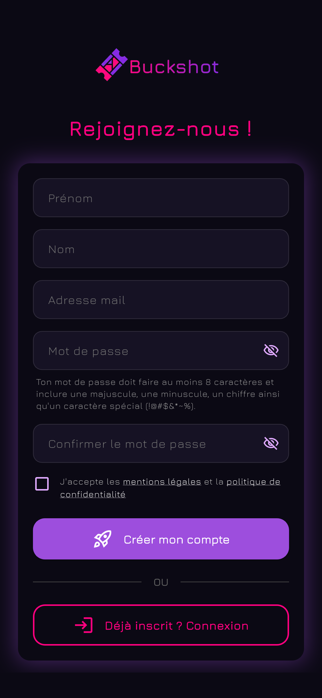

<em>Page d'inscription de l'application</em>

### 5.2 Page d'accueil

La page d'accueil affiche :

- **Le dernier shotgun en cours** *(le shotgun dont la billeterie à ouvert le plus récemment)*
- **Les têtes d'affiche** *(les shotguns les plus populaires)*
- **Vos inscriptions** *(les shotguns auxquels vous êtes inscrit et qui n'ont pas encore eu lieu, ou sont en cours)*
- **Nouveautés** *(les shotguns les plus récemment créés)*
- **Les prochains shotguns** *(les shotguns dont la date de l'événement est la plus proche)*

En haut de la page, une icone en forme de coeur vous permet d'accéder à vos favoris. Si cet icone est violet, cela signifie que vous avez ajouté au moins un shotgun à vos favoris. En cliquant sur cet icone, vous accédez à la liste de vos shotguns favoris. Si la billeterie d'un shotgun en favoris n'est toujours pas ouverte, vous recevrez une notification lorsque la billeterie de ce dernier ouvrira.

  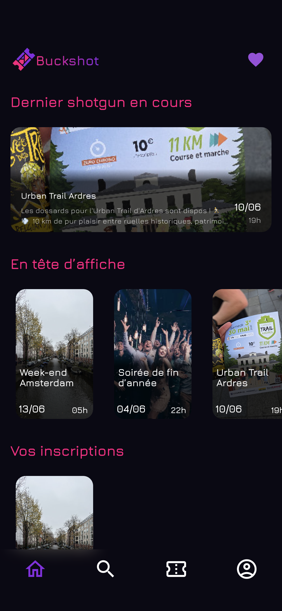

<em>Page d'accueil de l'application</em>

### 5.3. Page de détails d'un shotgun

En cliquant sur un shotgun, vous accédez à la page de détails de ce dernier. Cette page affiche les informations suivantes :

- **Le nom de l'événement**
- **La description de l'événement**
- **L'organisateur de l'événement**
- **La date et l'heure de début et de fin de l'événement**
- **Le lieu de l'événement**
- **Le nombre de places disponibles**

Si la billeterie est ouverte, vous pouvez vous inscrire à ce dernier. Dès lors, votre billet apparaitra dans la page **"Mes billets"**.  
Si la billeterie n'est pas encore ouverte, vous pouvez ajouter ce shotgun à vos favoris pour recevoir une notification lorsque la billeterie ouvrira. L'heure et la date d'ouverture de la billeterie sont indiquées sur cette page.

*Depuis cette page, un __organisateur__ peut également accéder à la page de gestion de cet événement.*

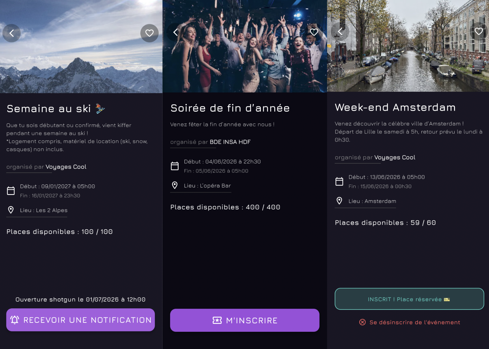
*Page de détails d'un shotgun*

### 5.4 Recherche de shotguns

La page de recherche vous permet de rechercher des shotguns en fonction de leurs noms. Ils sont triés comme suit :

- **A venir**
- **En cours**
- **Passés**

Lors du clic sur un shotgun, la page de détails de ce dernier s'affiche.

  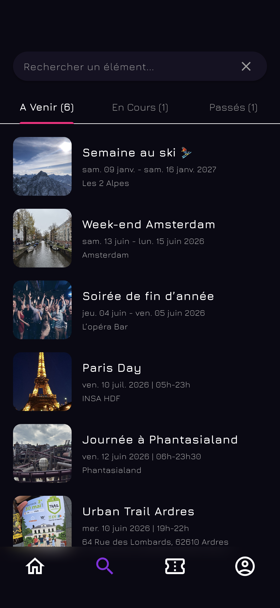

<em>Pages de recherche</em>

### 5.5 Mes billets

La page **"Mes billets"** affiche la liste de tous les shotguns auxquels vous êtes inscrit. En cliquant sur un shotgun, vous accédez à votre billet pour ce dernier. Ce billet contient un QR code qui sera scanné à l'entrée de l'événement pour valider votre entrée.
Ils sont regroupés en trois catégories :

- **A venir**
- **En cours**
- **Passés**

Chaque catégorie affiche le nombre de billets qu'elle contient.

  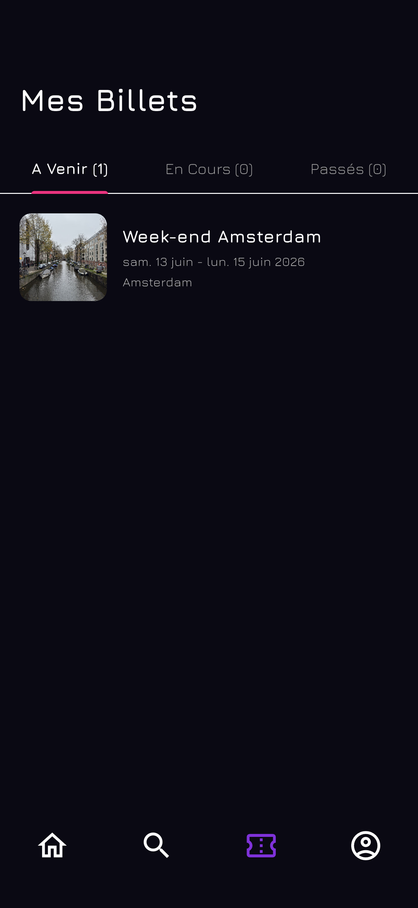

<em>Page "Mes billets"</em>

  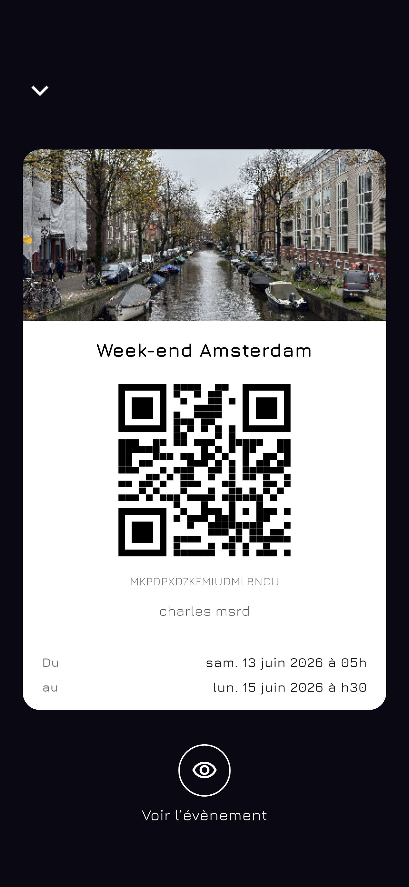

<em>Page affichant le QR code du billet</em>

### 5.6 Mon profil

La page de profil vous permet de : 

- Consulter et modifier vos informations personnelles (nom, prénom, adresse e-mail)

- Modifier votre mot de passe

- Vous déconnecter de votre compte

- Accéder aux mentions légales et à la politique de confidentialité de l'application

- Supprimer votre compte

- Rejoindre une structure si vous n'en avez pas encore rejoint une, ou voir votre rôle au sein de cette dernière le cas échéant.

  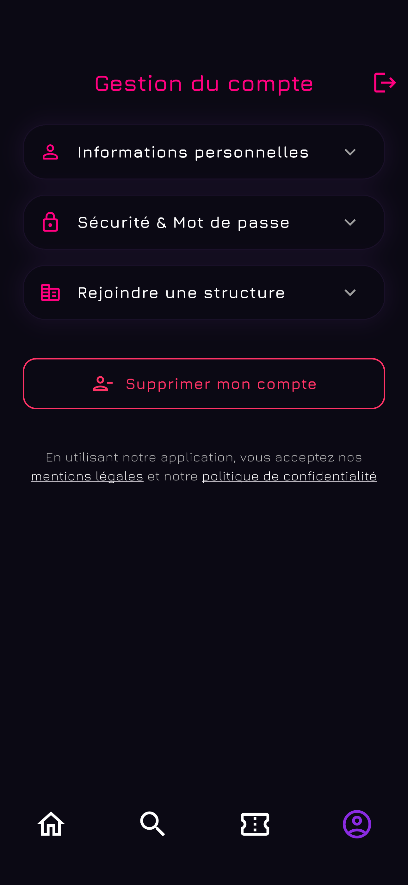

<em>Page de profil</em>

## 6. Fonctionnalités du staff

### 6.1 Voir la liste des événements de son organisationà venir

Le staff *(et donc les organisateurs)* ont accès à une page supplémentaire, permettant d'accéder à la liste de tous les événements de leur organisation, ainsi qu'aux scans des billets. Cette page affiche les événements à venir et en cours. 
Pour scanner les billets d'un événement, il faut cliquer sur ce dernier.
Les événements dont la date et l'heure de début ne sont pas atteints sont marqués comme étant "fermés", et les scans de billets sont donc impossible. Le scan de billets est rendu possible dès **30 minutes** avant le début officiel de l'événement, et ce jusqu'à la fin de ce dernier.

  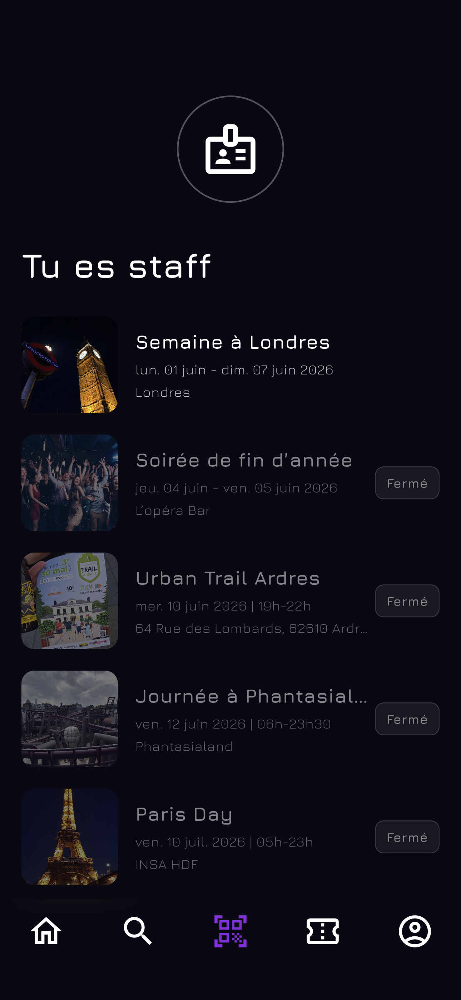

<em>Page des événements à venir ou en cours de son organisation</em>

### 6.2 Scan des billets

  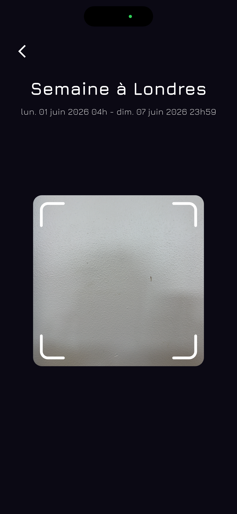

<em>Page afin de scanner les billets</em>

Dès lors qu'un qrcode est scanné, plusieurs cas sont possibles :

- **Billet valide** : Le billet est valide et n'a pas encore été scanné. L'entrée de l'utilisateur est validée, et le résultat du scan s'affiche en vert.

- **Billet déjà scanné** : Le billet est valide mais a déjà été scanné. La date et l'heure du scan précédent sont affichées, et le résultat du scan s'affiche en rouge.

- **Billet pour un autre événement** : Le billet est valide mais ne correspond pas à l'événement en cours. Le résultat du scan s'affiche en rouge.

- **Billet invalide** : Le billet n'est pas valide. Le résultat du scan s'affiche en rouge.

Une fois la page de résultat du scan affichée, le staff peut appuyer sur un bouton pour revenir à la page de scan et scanner le billet suivant, ou attendre 5 secondes pour que l'application revienne automatiquement à la page de scan.

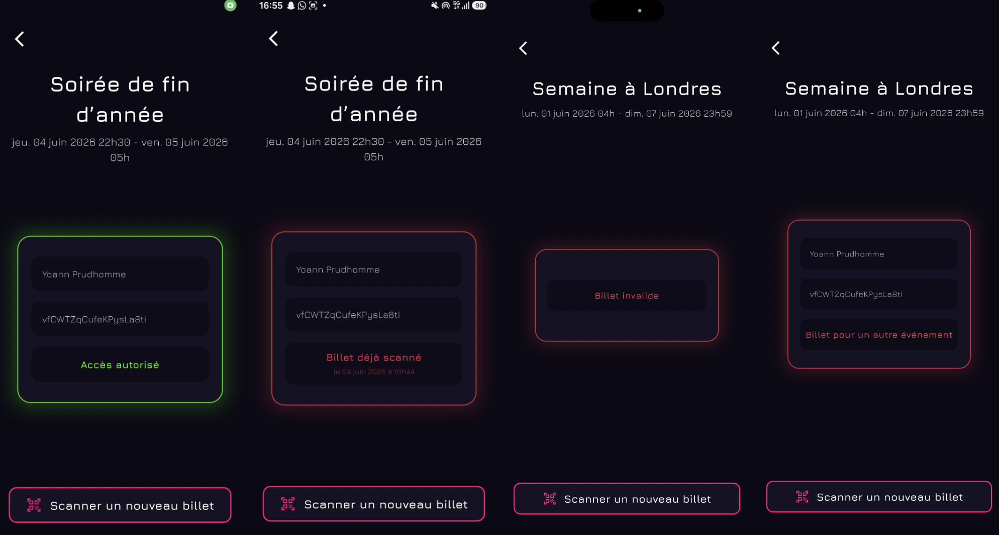
*Pages de résultat d'un scan de billet*

## 7. Fonctionnalités de l'organisateur

### 7.1 Visualisation et gestion de ses événements

Depuis la page **"Mes Billets"**, l'organisateur peut accéder à ses événements. En cliquant sur l'un d'entre eux, les détails de ce dernier s'affichent, et l'organisateur peut accéder à la page de gestion de cet événement. Cette page lui permet de :

- **Voir le nombre de places réservées**
- **Voir le taux de remplissage de l'événement**
- **Voir le nombre d'entrées validées (billets scannés)**
- **Accéder à la page de scan des billets de cet événement**
- **Modifier les informations de cet événement** : mêmes informations que lors de la création d'un événement
- **Annuler cet événement**
  

  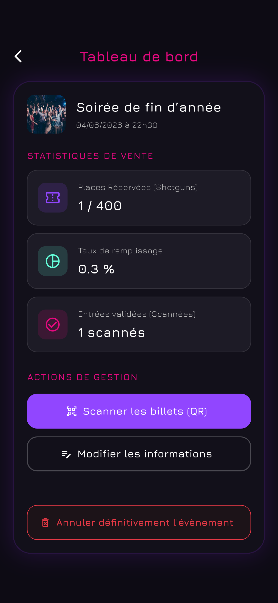

<em>Page des statistiques d'un événement</em>

### 7.2 Création (et modification) d'un événement

L'organisateur peut créer un événement en cliquant sur le bouton "Créer un événement" depuis la page de gestion de ses événements. Il doit alors renseigner les informations suivantes :

- **Le nom de l'événement**
- **La description de l'événement**
- **La date et l'heure de début et de fin de l'événement**
- - **La date et l'heure d'ouverture et de fermeture de la billeterie de l'événement**
- **Le lieu de l'événement**
- **Le nombre de places disponibles**
- **Ajouter une image à l'événement**

  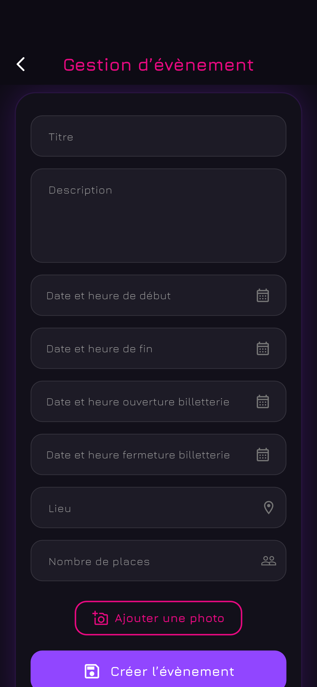

<em>Page de gestion d'un événement</em>

